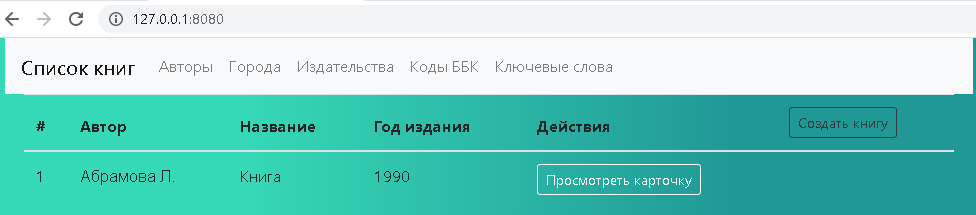
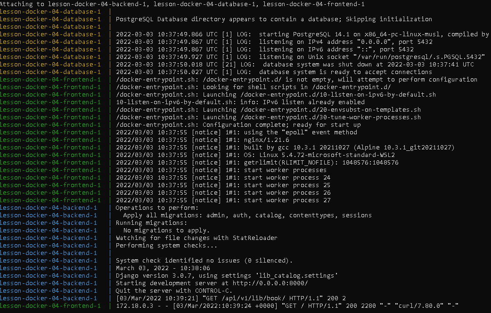

# DevOps Internship: Docker Task 4
## Hometask

Написать docker-compose.yaml, для всего проекта, собрать и запустить.

Критерий оценки финального задания:

1. Dockerfile должны быть написаны согласно пройденным best practices.
1. Для docker-compose необходимо использовать локальное image registry.
1. В docker-compose необходимо сетевые настройки 2 разных интерфейса(bridge):
    1. для фронта
    2. для бека с postgresql.

\* Осущиствить сборку проекта самим docker-compose команда docker-compose build (при использовании этого подхода необходимо исключить 2 пункт из критерии оценки).

## Solution

### Description

1. Производится multi-stage сборка для frontend
    * Этап Сборки приложения
        * Копируется файл с зависимостью в директорию /app
        * Загружаются зависимости необходимые для сборки
        * Производится сборка
    * Этап запуска приложения
        * И этапа сборки копируются данные в директорию /usr/share/nginx/html
        * Заменяется конфиг Nginx /etc/nginx/conf.d/default.conf в котором добавлена location для доступа к backend
            ```nginx
            location /api {
                proxy_pass http://backend:8000/;
                proxy_set_header X-Forwarded-For $proxy_add_x_forwarded_for;
                proxy_set_header X-Real-IP $remote_addr;
                proxy_set_header Host $host;
            }
            ```
2. Производится сборка для backend
    * Копируем в директорию /app requirements.txt
    * Устанавливается curl для использования healthcheck
    * Устанавливаем компоненты необходимые для сборки lxml (**Изменена версия с 4.5.1 на 4.5.2** из-за найденной в модуле ошибке [Подробности...](https://bugs.launchpad.net/lxml/+bug/1881960))
    * Отдельно устанавливаем модуль psycopg2-binary
    * С помощью pip устанавливаем зависимости из файла requirements.txt
    * Копируем исходный код приложения в директорию /app
    * Переключаемся на пользователя 10001
    * В CMD запускаем вначале миграцию, потом сервер
3. Запускаем образ в базой данных

### Scheme


## Result


